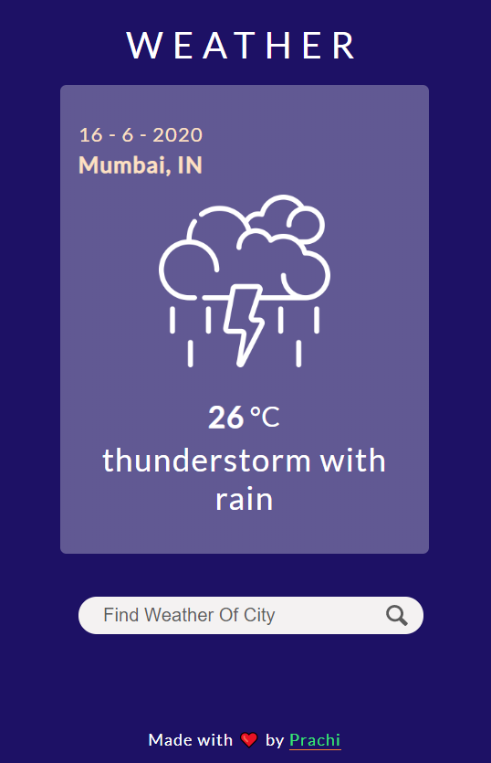

<h3>Vanilla JS Weather Finder Using openweathermap API and gsap plugin </h3>

### Preview :

This weather finder website is built using html, css and JavaScript. Using this we can get current weather of our location and also we can search the weather by city name. I have used openweathermap api to get the data and gsap js plugin for animation. 

### Links:
- [openweathermap api](https://openweathermap.org/api)
- [GSAP plugin](https://greensock.com/gsap/)

> Click here for demo : [Weather Finder](https://pm0824.github.io/JavaScript-Weather-Finder/)

> Follow my [Codepen](https://codepen.io/girl_inwebdev) profile for more JavaScript Projects

> Connect with me on instagram - [girl.inwebdev](https://www.instagram.com/girl.inwebdev/) to learn web developent together

